# CodeDumper - IDA Pro Plugin

A powerful IDA Pro plugin for dumping decompiled code and generating call graphs with advanced cross-reference analysis capabilities.

## Overview

CodeDumper is an advanced IDA Pro plugin that enables researchers to extract decompiled code for functions along with their complete call graphs (callers, callees, and references). The plugin supports both code extraction to C files and call graph visualization through DOT format files compatible with Graphviz.

## Key Features

### Core Functionality
- **Comprehensive Code Dumping**: Extracts decompiled C code for selected functions and their related functions
- **Call Graph Generation**: Creates DOT format graphs for visualization with Graphviz
- **Bidirectional Analysis**: Traverses both upward (callers) and downward (callees/references) in the call graph
- **Configurable Depth**: Customizable traversal depth for both caller and callee analysis
- **Multi-Function Support**: Process single functions or multiple functions simultaneously

### Advanced Analysis Capabilities
- **Direct Call Detection**: Standard function calls via `call` instructions
- **Indirect Call Resolution**: Resolves targets through backward def-use analysis within basic blocks:
  - Uses IDA's FlowChart for basic block boundary detection
  - Traces register/memory definitions backwards within blocks
  - Handles simple MOV patterns for function pointer resolution
- **Virtual Call Detection**: Identifies and resolves C++ virtual function calls through VTable analysis
- **Jump Table Support**: Detects and follows switch statement jump tables:
  - Uses IDA's switch_info API when available
  - Falls back to manual pattern detection for `jmp [table + reg*scale]`
  - Follows up to 20 table entries (configurable limit)
- **Data Reference Tracking**: Finds functions referenced through data operations (e.g., `mov reg, offset func`)
- **Immediate Reference Detection**: Identifies function addresses used as immediate operands
- **Tail Call Recognition**: Detects the `push <addr>; ret` pattern for tail call optimization
- **Dynamic Import Awareness**: Basic support for GetProcAddress and similar dynamic loading patterns

### User Interface Integration
- **Context Menu Integration**: Right-click options in the Pseudocode view
- **Main Menu Integration**: Available under "Edit → Plugins → Code Dumper"
- **Progress Indication**: Real-time progress updates during analysis
- **Thread-Safe Operation**: Background processing with proper IDA API synchronization

## Requirements

- **IDA Pro 7.6+** (with Python 3 support)
- **Hex-Rays Decompiler** (required for code decompilation)
- **PyQt5** (for dialog boxes and UI elements)
- **Python 3.x**

## Installation

1. **Download the Plugin**
   ```bash
   git clone https://github.com/yourusername/ida-codedump.git
   ```

2. **Copy to IDA Plugins Directory**
   - Windows: `%IDADIR%\plugins\`
   - Linux/macOS: `$IDADIR/plugins/`
   
   Copy the entire `codedump` directory to your IDA plugins folder.

3. **Verify Installation**
   - Start IDA Pro
   - Check for "CodeDumper" in the console output
   - Verify menu items appear under "Edit → Plugins → Code Dumper"

## Usage

### Single Function Analysis

#### Via Context Menu (Pseudocode View)
1. Open a function in the Pseudocode view
2. Right-click to open the context menu
3. Select one of:
   - **"Dump Function + Callers/Callees/Refs..."** - For code extraction
   - **"Generate DOT Graph + Callers/Callees/Refs..."** - For graph visualization

#### Configuration Dialog
You'll be prompted to specify:
- **Caller Depth**: How many levels up to traverse (0 = no callers)
- **Callee/Ref Depth**: How many levels down to traverse (0 = no callees)
- **Cross-Reference Types**: Which types of references to include:
  - `direct_call`: Standard function calls
  - `indirect_call`: Calls through registers/memory
  - `data_ref`: Data references to function addresses
  - `immediate_ref`: Immediate operands containing function addresses
  - `tail_call_push_ret`: Push/ret tail call pattern
  - `virtual_call`: C++ virtual function calls
  - `jump_table`: Switch statement targets
- **Maximum Characters**: Optional limit for output file size (0 = no limit)
- **Output File**: Where to save the results

### Multiple Function Analysis

1. Go to **"Edit → Plugins → Code Dumper"**
2. Select either:
   - **"Dump Code for Multiple Functions..."**
   - **"Generate DOT Graph for Multiple Functions..."**
3. Enter a comma-separated list of functions:
   - By name: `main, sub_401000, MyFunction`
   - By address: `0x401000, 0x402000`
   - Mixed: `main, 0x401000, sub_403000`
4. Configure the same options as single function analysis

### Output Formats

#### Code Dump (.c files)
```c
// Decompiled code dump generated by CodeDumper
// Start Function: 0x401000 (main)
// Caller Depth: 2
// Callee/Ref Depth: 3
// Total Functions Found: 15
// Included Functions (15):
//   - main (0x401000)
//   - sub_401100 (0x401100)
//   - ...

// Incoming xrefs for main (0x401000): _start (0x400500) [direct_call]
// Outgoing xrefs for main (0x401000): printf (0x400600) [direct_call], sub_401100 (0x401100) [direct_call]
// --- Function: main (0x401000) ---
int __cdecl main(int argc, char **argv)
{
    // ... decompiled code ...
}
// --- End Function: main (0x401000) ---
```

#### DOT Graph (.dot files)

```dot
# DOT graph generated by CodeDumper
# Start Function: 0x401000 (main)
# Caller Depth: 2
# Callee/Ref Depth: 3
# Total Nodes: 15
#
# --- Legend ---
# Solid Line: Direct Call
# Bold Line: Virtual Call
# Dashed Line: Indirect Call / Jump Table
# Bold Dashed Line: Tail Call (push/ret)
# Dotted Line: Data / Immediate Reference

digraph CallGraph {
    graph [splines=ortho];
    node [shape=box, style=filled, fillcolor=lightblue];
    edge [color=gray50];
    
    "0x401000" [label="main\n(0x401000)" fillcolor=red];
    "0x401100" [label="sub_401100\n(0x401100)"];
    
    "0x401000" -> "0x401100" [style=solid, tooltip="direct_call"];
}
```


**Note**: Long function names in graph nodes are automatically truncated to 40 characters for better visualization.

### Visualizing DOT Graphs

Use Graphviz to visualize the generated DOT files:

```bash
# Generate PNG image
dot -Tpng output.dot -o call_graph.png

# Generate SVG (scalable)
dot -Tsvg output.dot -o call_graph.svg

# Generate PDF
dot -Tpdf output.dot -o call_graph.pdf
```

## Advanced Features

### Cross-Reference Type Filtering
Control which types of references to follow during traversal:
- Use "all" to include all types (defaults to all 7 types: direct_call, indirect_call, data_ref, immediate_ref, tail_call_push_ret, virtual_call, jump_table)
- Specify individual types: `direct_call,data_ref,virtual_call`
- Exclude specific types for focused analysis
- Each edge in the graph maintains a set of all applicable reference types

### Size Limiting
When dealing with large codebases:
- Set a maximum character limit for output files
- The plugin will intelligently prune less important functions using an automatic algorithm:
  - Functions are sorted by output size (smallest first)
  - Removes functions starting with the smallest code size
  - Starting functions are always preserved regardless of size
  - Pruning continues until the output fits within the specified limit

### Virtual Function Analysis
For C++ binaries:
- Automatic VTable detection in read-only data segments:
  - Scans for sequences of ≥3 consecutive pointers to code functions
  - Validates pointers point to valid code segments
  - Properly handles both 32-bit and 64-bit architectures
- Virtual call resolution through pattern matching:
  - Detects `call [reg+offset]` patterns
  - Maps offsets to VTable entries
  - Resolves to specific virtual functions when possible
- Tracks inheritance hierarchies when possible

### Background Processing
- All analysis runs in background threads
- UI remains responsive during long operations
- Progress updates via wait boxes showing real-time function names during decompilation
- Proper synchronization with IDA's main thread
- Concurrency control prevents multiple simultaneous operations:
  - Single function dumps are tracked individually
  - Multi-function dumps block other operations
  - Prevents race conditions and ensures data consistency

## Troubleshooting

### Common Issues

1. **"PyQt5 not found" Error**
   - Install PyQt5 in IDA's Python environment
   - Verify IDA is using the correct Python installation

2. **"Hex-Rays decompiler is not available"**
   - Ensure you have a valid Hex-Rays license
   - Check that the decompiler is properly initialized

3. **No menu items appear**
   - Check IDA's console for initialization errors
   - Verify the plugin files are in the correct location
   - Ensure `ida-plugin.json` is present alongside `codedump.py`

4. **Decompilation failures**
   - Some functions may not be decompilable (e.g., data, imports)
   - Check for obfuscated or corrupted code
   - Verify function boundaries are correctly defined

### Performance Tips

- Start with smaller depth values (1-2) for initial exploration
- Use cross-reference type filtering to reduce graph complexity
- Set character limits for very large codebases
- Process multiple related functions together for efficiency

## Technical Details

### Threading Model
- Main IDA API calls use `execute_sync()` for thread safety
- File I/O operations run in background threads
- UI updates via `execute_ui_requests()`
- Concurrency control using thread locks and operation tracking

### Memory Efficiency
- Visited sets prevent infinite recursion
- Incremental processing for large graphs
- Efficient edge storage using defaultdict with set values for multiple edge types
- Function decompilation results cached during processing

### Graph Traversal Algorithm
- Depth-first search for both caller and callee traversal
- Maintains separate visited sets for callers and callees
- Early termination when depth limit reached
- Handles circular dependencies gracefully

### Compatibility
- IDA 7.6+ (uses modern `ida_` module names)
- Compatible with IDA 9.x
- Python 3.x required
- Cross-platform (Windows, Linux, macOS)
- Adapts to platform-specific differences:
  - Segment names (e.g., ".text" on Linux/Windows, "__text" on macOS)
  - Automatically detects 32-bit vs 64-bit architectures

## Contributing

Contributions are welcome! Please feel free to submit issues or pull requests.

### Development Guidelines
- Maintain thread safety for all IDA API calls
- Add new cross-reference types to the allowed_types system
- Update both code dump and DOT generation for new features
- Include appropriate error handling and logging

## License

This project is licensed under the MIT License - see the LICENSE file for details.

## Acknowledgments

- IDA Pro and Hex-Rays teams for the excellent reverse engineering platform
- The IDA Pro plugin development community for examples and best practices

## Version History

- **1.0.0** - Initial release with full feature set
  - Direct and indirect call analysis
  - Virtual function resolution
  - DOT graph generation
  - Multi-function support
